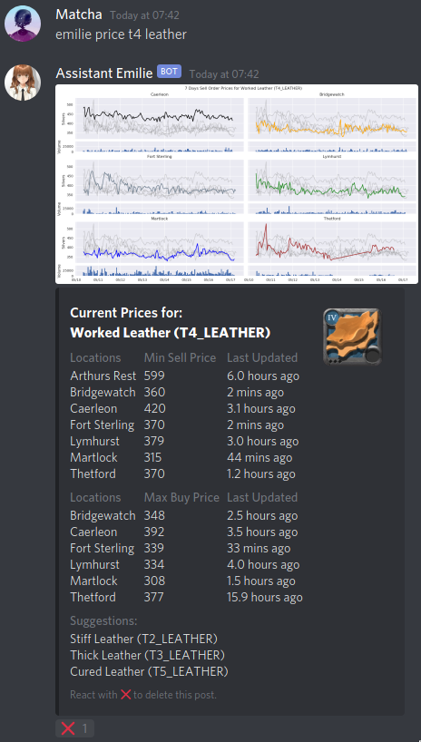

# Albion Online Discord Assistant Bot

[](https://github.com/psf/black)
[](https://www.gnu.org/licenses/gpl-3.0)

<a href='https://ko-fi.com/Z8Z11EXA0' target='_blank'></a>

## Meet The Assistant



Thanks to the [Albion Online Data Project](https://www.albion-online-data.com/), and the many players that download and run the Data Project [client](https://github.com/BroderickHyman/albiondata-client/releases) while playing the game, market price data are collected and shared freely with all Albion players. Perhaps the most popular tool that utilized these data is [AlbionOnline2D](https://www.albiononline2d.com/en/item).

The Discord bot fetches the latest minimum sell order prices (same as AlbionOnline2D), and plots the past 7 days historical prices, for the item that you asked. The assistant will find the closest match to your query and also provides item suggestions in case you forgot how to spell. What a sweet assistant.

## How do I get the Assistant?

**Host it yourself**.

## Features

```
emilie price <item name>
```
+ Returns latest minimum sell order prices as Discord embed, and plots 7 days historical prices. (First screenshot)
```
emilie quick <item name>
```
+ Same as previous command, but no plotting of 7 days historical prices (faster).
```
emilie search <option> <player/guild name>
```
+ `<option>` can be `player` or `guild`.
+ Search and returns details about a player/guild.
+ [Screenshot: Searching for player](Images/eg_player.png)
+ [Screenshot: Searching for guild](Images/eg_guild.png)

```
emilie gold <number of days>
```
+ Return past 6 hours gold prices, and plots past `<number of days>` gold prices.
+ [Screenshot: Plotting gold prices for past 7 days](Images/eg_gold.png)

Admin commands (Only for self-hosted bots):
```
emilie extension <option> <cogs filenames>
```
+ `<option>` can be `load`, `unload`, `reload`.
+ Load/Unload/Reload cogs in the cogs folder, e.g. if you want to remove or add certain features.
```
emilie ping
```
+ Bot will return the latency.
```
emilie eval <python variables/generators>
```
+ eval is simply the Python function [eval](https://docs.python.org/3.5/library/functions.html#eval).
+ Allows you to check stuffs that the bot knows, i.e. list of members, servers the bot is in etc.
+ [Screenshot: Listing all users with the role 'Member'](Images/eg_member.png)
```
emilie exec <python codes>
```
+ exec is the Python function [exec](https://docs.python.org/3.5/library/functions.html#exec).
+ This is a powerful command and care must be taken when using it.
+ This command allows you to run any Python code, thus it can be abused to spam or perform tasks that breaks the bot.
+ [Screenshot: Finding the first 300 primes](Images/eg_primes.png) (I know this is arbitrary... but just to show you what it can do.)

The eval and the exec commands are there because I got tired of adding features to the bot.

I don't have to implement anything if I can simply run arbitrary codes.

*- Famous last words before breaking everything*

## Hosting it yourself

#### Create a Discord bot account

1. First go to Discord's [developer portal](https://discordapp.com/developers/applications/).
2. Create an application by clicking on **New Application**.
3. Click on your newly created application, and on the left panel click on **Bot**.
4. Build a bot by clicking on **Add Bot**.
5. You have now created a bot account.

#### Run the Assistant as your bot account

1. Download all the files in this repository, and the requirements. (Look at **Requirements** below)
2. In your bot page in Discord's developer portal, copy the bot's **TOKEN**.
3. Edit **config.ini**, and change `botToken = abcdefghijklmnopqrstuvwxyz` to `botToken = your copied token`. This is to tell the program to use your bot account.
4. Open **cmd** or your **terminal** in the directory where you downloaded the files. Run `python main.py`.
5. Your bot should now be hosted on your computer and you should see the message:
```
Logged in as Bot_Username#1234.
Connected to:
```

#### Invite your Assistant bot

1. In your application page in Discord's developer portal, click on **OAuth2**.
2. Under **Scopes** tick the **bot** box.
3. Choose the **Bot Permissions** below as you like.
4. Copy the link under **Scopes** once done, and open in your browser.
5. Choose your server and go through annoying reCaptcha and you are done.
6. Everytime you start the bot, the message will now say:
```
Logged in as Bot_Username#1234
Connected to:
Your server name
```

#### Configs

1. Inside **config.ini** you can change or append:
```ini
adminUsers = 'username1#1234', 'username2#1234'
commandPrefix = 'emilie ', 'Emilie '
```
  + commandPrefix is how the bot should be called.
  + Being an admin user allows you to load/unload/reload cogs, and access **utils.py** commands.
  + The **utils.py** cog contain powerful commands that should only be callable by admin users.
  + Such commands can be abused to spam the server or to kick members. (Refer to **Features** below)

2. You can also change:
```ini
debugChannelID = 12345678
workChannelID = 12345678, 12345678
debug = False
onlyWork = False
```
  + If **debug** is True, then the bot will send debug messages to the channel specified by **debugChannelID**.
  + If **onlyWork** is True, then bot will only work in channels specified by **workChannelID**.
  + Channel IDs can be obtained by first enabling developer mode in Discord under Settings>Appearance. Then right clicking on a channel and click on Copy ID.

### Requirements

+ Python 3.6 or higher
+ [discord.py](https://github.com/Rapptz/discord.py)
  + The bot is written with discord.py, an async API.
+ [matplotlib](https://matplotlib.org/)
  + matplotlib is required to plot the 7 days historical prices.

  To install the required Python libraries, run the command:
  ```
  pip install discord.py matplotlib
  ```
  Or if you use `conda`:
  ```
  conda install matplotlib
  ```

## Planned Features

+ Item data search to show recipes etc.
  + This is also possible but not implemented yet.
  + The item search API is already included in the the cog **cogs/search.py**, but nothing is done with it yet.

## Contributing

I would greatly appreciate it if you can help in any of the following ways:

+ If you play the game frequently, download and run the [Data Project Client](https://www.albion-online-data.com/) while playing the game.
+ If you have some programming know-how, contribute some new features, bug fixes, or optimizations to Emilie.
+ If you find Emilie's forced labors useful to you, please consider a small donation. Your donation will help Emilie find a new home in a better server.

[](https://ko-fi.com/Z8Z11EXA0)

## Extra Background

This is a stripped-down version of a bot I made for my guild, Pangolin Trading Company. As I haven't been on Albion for quite a while, I am releasing the source codes of the bot so that the community can improve upon or implement their own bots. The stripped functions are those that were specific to the guild. For example:

+ Fetch data from guild's Google Sheets
+ Edit data in guild's Google Sheets
+ Send guild's server welcome messages
+ Send direct messages to guild members

The cogs of these features are in the '**Unused cogs**' folder, so you can refer to them if you want to implement these features yourself.

## License
See the [LICENSE](LICENSE) file for license rights and limitations.

